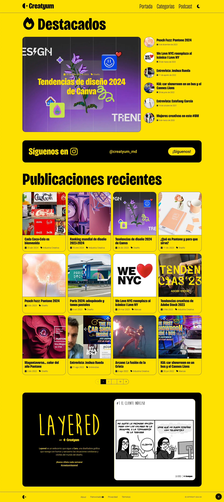

# Creatyum Media

**Creatyum es una revista digital en formato de blog y podcast creada por [Alejandro Martir](https://alemartir.com) en 2014.** Desde su lanzamiento en octubre de ese año, Creatyum busca ser un medio de divulgación sobre diseño e industria creativa. Nuestro objetivo principal es proporcionar contenido de calidad que inspire, eduque y empodere a nuestra audiencia.

Nos dedicamos a explorar diversas áreas del diseño y de las industrias creativas, ofreciendo a nuestros lectores y oyentes una perspectiva amplia sobre estos temas. **Este proyecto es la nueva versión del blog por el décimo aniversario de Creatyum.**

